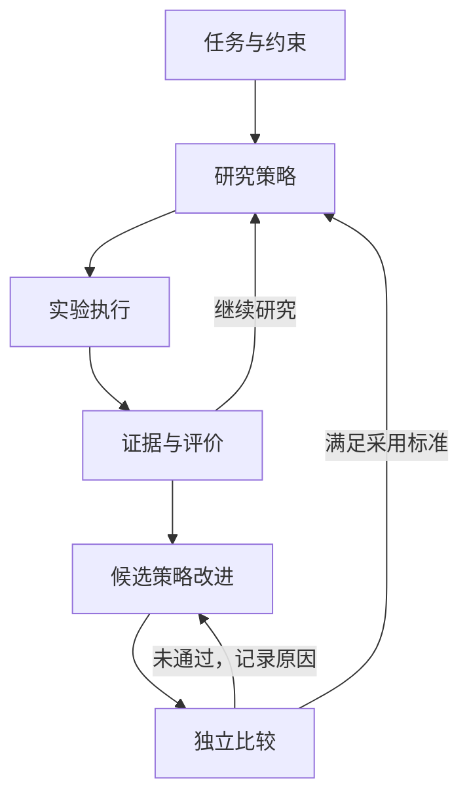

# 架构与职责

状态：已确认方向，接口和实现仍为草案。基线日期：2026-09-07。

## 五个部分

| 部分 | 责任 | 不承担的责任 |
|---|---|---|
| 任务接入 | 项目身份、能力发现、环境与评价声明 | 假设任何任务天然可评估 |
| 运行核心 | 状态、作业、预算、版本、产物索引 | 固定科研推理步骤 |
| 研究策略 | 假设、计划、工具选择、分析、后续建议 | 自行扩大授权或改写历史结果 |
| 证据与经验 | 原始证据引用、结论支持关系、经验范围 | 用摘要替代全部原始记录 |
| 改进与评估 | 候选策略、比较、采用与回退 | 用候选自己的声明证明进步 |

运行核心提供稳定操作；策略通过操作组织工作。可以是一个 Agent，也可以是多个 Agent。分工和信息流属于策略配置，核心不能要求永远经过固定角色。

## 两个循环

研究任务优化的是目标问题；元任务优化的是研究系统。两者使用不同任务编号、工作分支和预算，建立关联但不混写状态。

## 仓库边界

- researchOS：核心、通用策略、接入器、协议与框架评估。
- 研究仓库：算法、实验配置、项目问题、证据索引和研究决策。
- physical_ai_runtime 等基础设施仓库：设备和传感器接口；仅由需要它的项目适配器接入。
- 外部存储：大数据、模型、视频和大型日志，以稳定标识和内容摘要引用。

第一版通过本地项目连接。远程执行是另一个 backend，不能把本机路径误当远端路径。项目 ID 跨机器稳定，本机绑定分别配置。

## 可演进边界

模型后端、上下文组织、技能、规划策略、执行后端、评价器均版本化。评价器可以开发新版，但一次新旧候选比较固定相同评价版本。

固定的是数据和生命周期契约，而不是今天的提示或 Agent 拆分。依赖选择等实现细节见决策记录；实现前不建立没有使用者的大型抽象体系。
